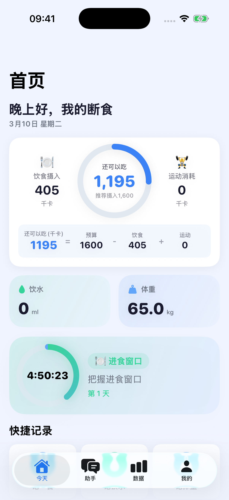
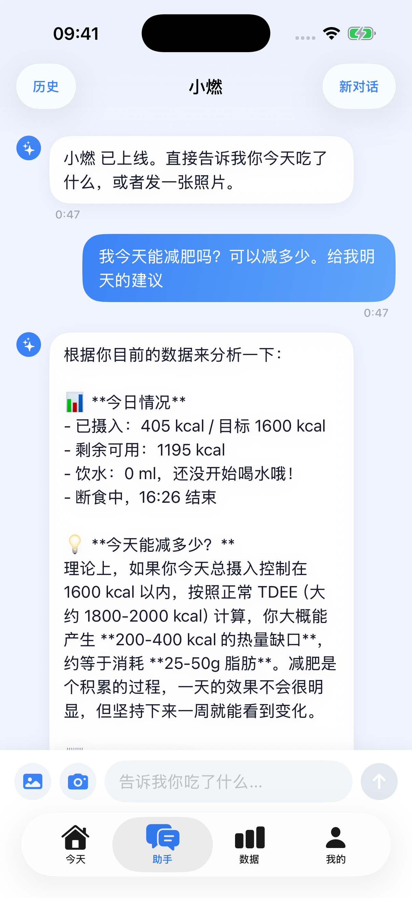
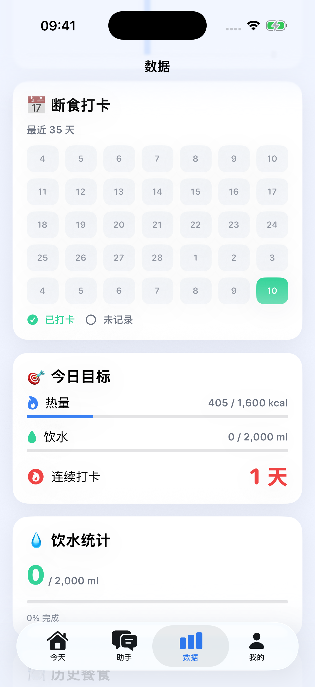
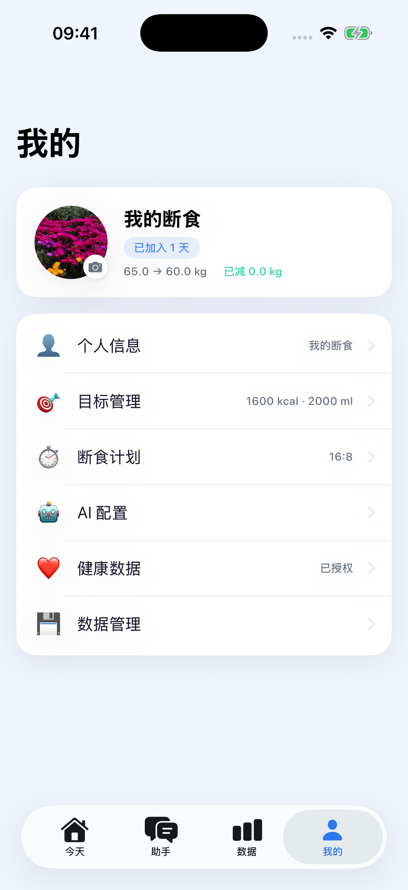
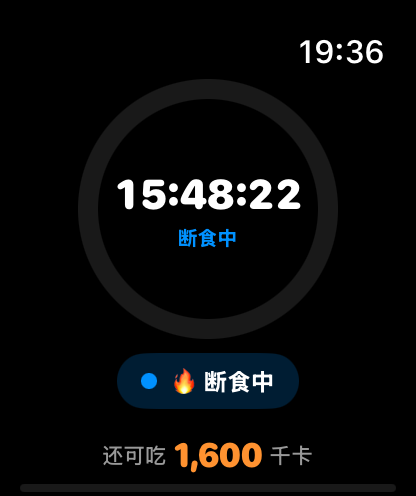

# FastingLens 断食镜

AI 驱动的断食追踪 & 减肥助手，支持 iPhone + Apple Watch + 表盘组件。

## 截图

### iPhone

| 首页 | AI 助手 | 数据统计 | 我的 |
|:---:|:---:|:---:|:---:|
|  |  |  |  |
| 断食倒计时 · 热量环 · 饮水体重 | AI 拍照识别 · 智能减肥建议 | 断食打卡 · 热量饮水统计 | 个人设置 · 断食计划 · AI 配置 |

### Apple Watch



断食进度环 · 剩余热量 · 实时倒计时

## 功能

- 🍽️ **断食计划管理** — 16:8 等多种断食模式
- 📸 **AI 拍照识别** — 拍照自动识别食物和热量
- 🤖 **AI 助手对话** — 智能减肥建议
- ⌚ **Apple Watch** — 手表查看断食状态、进度环、热量
- 🎯 **表盘组件** — Corner/Circular/Rectangular/Inline 四种样式
- 📊 **iPhone 小组件** — 主屏幕和锁屏小组件

## 一键部署

证书过期后（7天），在 Mac 上运行：

```bash
cd /Users/flipos/OtherProject/FastingLens
./deploy.sh
```

### 前置条件

- Xcode 已安装且登录 Apple ID
- iPhone 通过 USB 连接 Mac
- Apple Watch 与 Mac 在同一 WiFi 且屏幕亮着

### 手动部署

```bash
# 1. 构建
xcodebuild archive -scheme FastingLens -destination 'generic/platform=iOS' \
  -archivePath ~/Desktop/FastingLens.xcarchive \
  -allowProvisioningUpdates DEVELOPMENT_TEAM=87NDQ6Q8C7

# 2. 安装 iPhone
xcrun devicectl device install app \
  --device FC2BC738-9AA3-5457-8F98-BC0863FFD1CA \
  ~/Desktop/FastingLens.xcarchive/Products/Applications/FastingLens.app

# 3. 安装 Watch
xcrun devicectl device install app \
  --device F6A52272-2C2E-55D6-8CFA-E8D6CB45B85E \
  ~/Desktop/FastingLens.xcarchive/Products/Applications/FastingLens.app/Watch/FastingLens\ Watch.app
```

### 查看设备 UDID

如果更换了设备，用以下命令查看新 UDID：

```bash
xcrun devicectl list devices
```

然后修改 `deploy.sh` 中的 `IPHONE_UDID` 和 `WATCH_UDID`。

## 项目结构

```
FastingLens/
├── FastingLensApp/            # iPhone 主应用
├── FastingLensWatchApp/       # Watch 应用壳
├── FastingLensWatchExtension/ # Watch 应用逻辑
├── FastingLensWatchWidgets/   # Watch 表盘组件
├── FastingLensWidget/         # iPhone 小组件
├── AppFeatures/               # 共享数据层 (SPM Package)
└── deploy.sh                  # 一键部署脚本
```

## 技术栈

- SwiftUI + WidgetKit
- WatchConnectivity (iPhone ↔ Watch 数据同步)
- App Groups (跨 target 数据共享)
- CloudKit (iCloud 数据存储)

## License

MIT
