<div align="center">

# FastingLens 断食镜

### AI 驱动的断食追踪 & 减肥私人助手

**拍照即识别热量 · 对话即完成记录 · 零手动操作 · 数据全本地**

[](https://swift.org)
[](https://developer.apple.com)
[](LICENSE)

**完全免费 · 无订阅 · 无广告 · 自带 API Key 即用**

</div>

---

## Why FastingLens?

大多数减肥 App 需要你**手动搜索食物、输入克数、选择餐次**——太麻烦了，根本坚持不下来。

FastingLens 用了一个全新的模式：**一切操作都通过 AI 对话完成**。

> 拍一张照片发给 AI → 自动识别每种食物和热量 → 一键确认入账
> 说一句"帮我记 500ml 水" → 自动记录
> 问"我今天还能吃多少" → AI 结合你的 TDEE、断食状态、运动消耗给出建议

**你只需要聊天，剩下的 AI 全搞定。**

---

## Screenshots

<table>
<tr>
<td align="center"><b>首页仪表盘</b></td>
<td align="center"><b>AI 拍照识别</b></td>
<td align="center"><b>识别结果卡片</b></td>
<td align="center"><b>桌面小组件</b></td>
</tr>
<tr>
<td>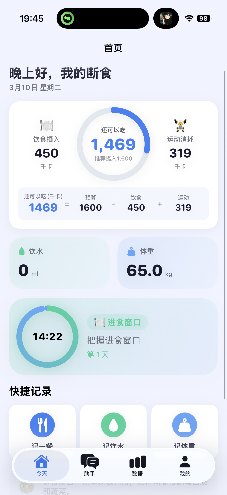</td>
<td>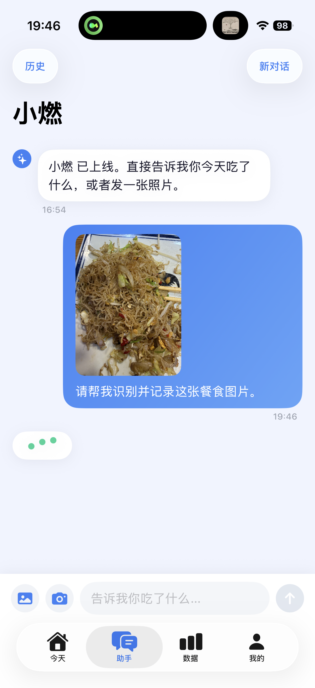</td>
<td>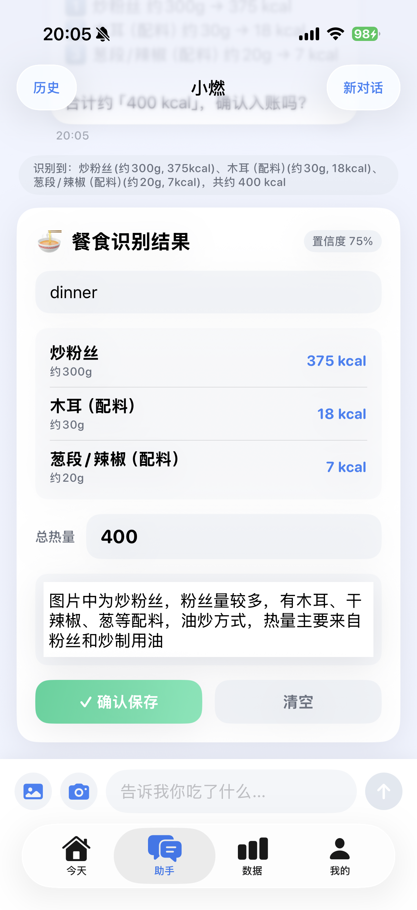</td>
<td>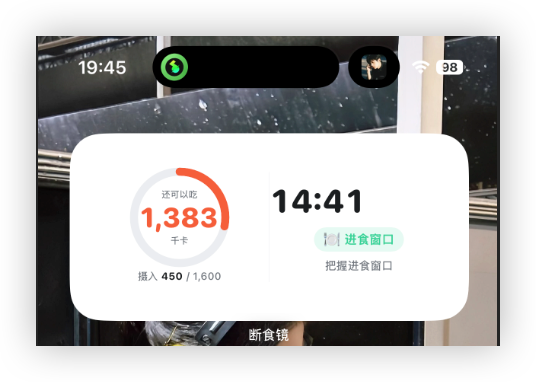</td>
</tr>
<tr>
<td align="center"><b>记一餐</b></td>
<td align="center"><b>记饮水</b></td>
<td align="center"><b>记体重</b></td>
<td align="center"><b>断食计划</b></td>
</tr>
<tr>
<td>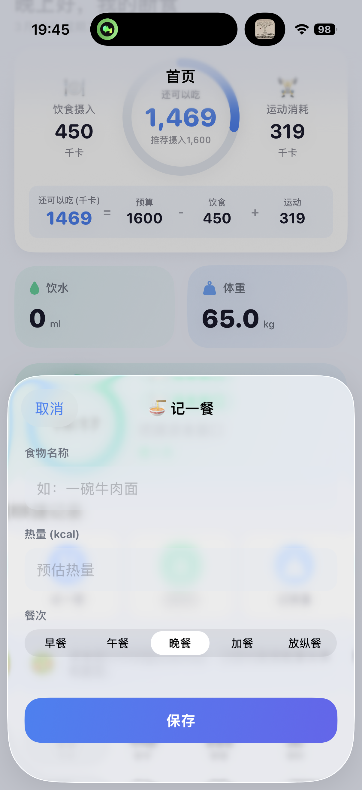</td>
<td>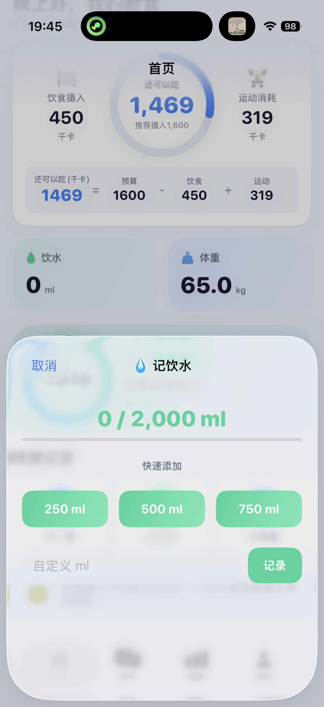</td>
<td>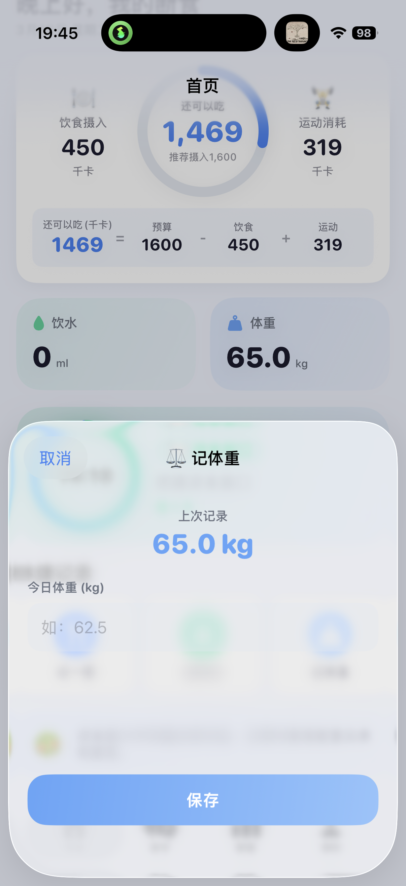</td>
<td>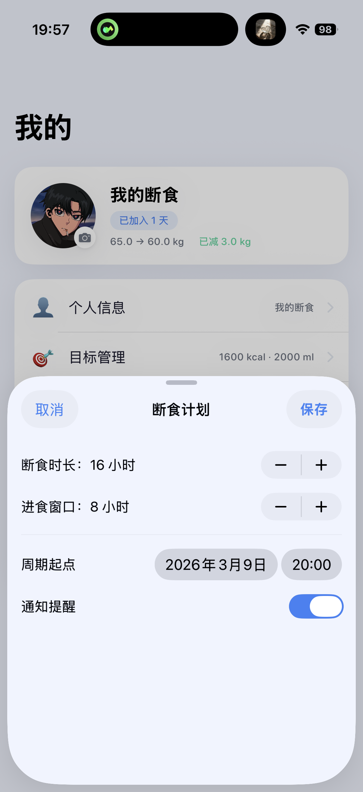</td>
</tr>
<tr>
<td align="center"><b>数据统计</b></td>
<td align="center"><b>断食打卡</b></td>
<td align="center"><b>健康数据</b></td>
<td></td>
</tr>
<tr>
<td>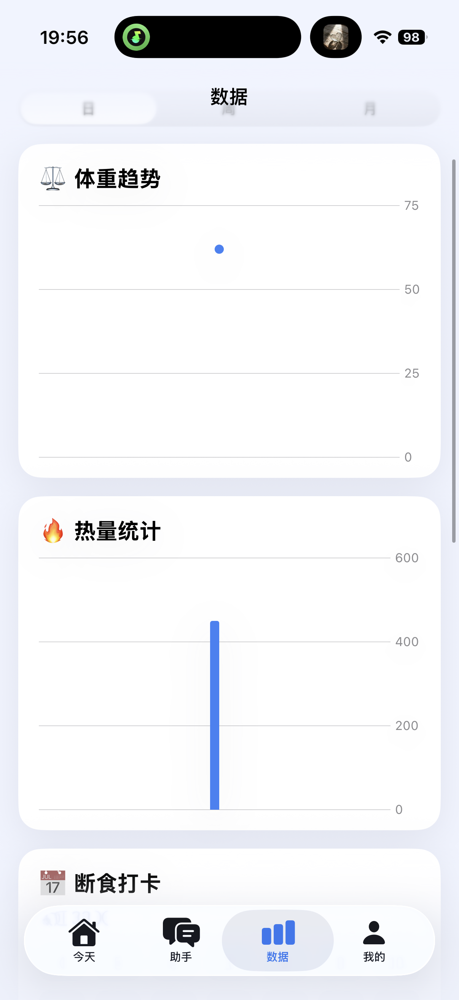</td>
<td>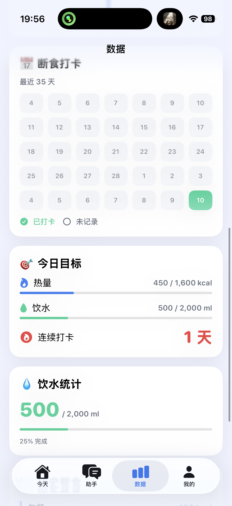</td>
<td>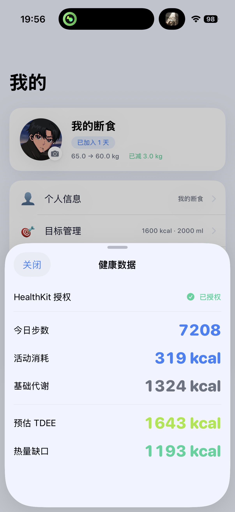</td>
<td></td>
</tr>
</table>

---

## Core Features

### AI 对话驱动（核心亮点）
- **拍照识别** — 拍一张食物照片，AI 自动识别每种食物、估算份量和热量，生成识别卡片，确认即入账
- **自然语言记录** — "帮我记 500ml 水"、"午餐吃了一碗牛肉面大概 600 卡" 直接对话完成
- **智能减肥建议** — AI 结合你的 TDEE、体重趋势、断食状态，给出个性化饮食建议
- **多轮工具调用** — AI 可以查询你的历史数据、调整计划、删除错误记录，全程对话操作

### 断食追踪
- 16:8 / 18:6 / 20:4 等多种断食模式
- 实时倒计时 + 进食窗口提醒
- 断食打卡日历，连续打卡天数统计

### 全平台覆盖
- **iPhone 主屏小组件** — 锁屏就能看到剩余热量和断食倒计时
- **Apple Watch App** — 手腕上查看断食进度环、剩余热量
- **Watch 表盘组件** — Corner / Circular / Rectangular / Inline 四种样式

### 健康数据整合
- 自动读取 HealthKit 步数、活动消耗
- 计算 TDEE 和每日热量缺口
- 体重趋势图表追踪

### 隐私优先
- **数据全部存储在本地**，不上传任何服务器
- AI 调用使用你自己的 API Key，流量只走你的账户
- 无账号系统、无注册、无追踪

---

## Quick Start

1. Clone 项目并用 Xcode 打开
2. 进入 App →「我的」→「AI 配置」
3. 填入你的 API Endpoint 和 Key（支持 Claude / OpenAI 兼容接口）
4. 开始和 AI 助手聊天，拍照记餐！

---

## Deploy to Device

证书过期后（7 天），在 Mac 上运行：

```bash
cd /path/to/FastingLens
./deploy.sh
```

### Prerequisites

- Xcode installed with Apple ID signed in
- iPhone connected via USB
- Apple Watch on same WiFi with screen on

### Manual Deploy

```bash
# 1. Build
xcodebuild archive -scheme FastingLens -destination 'generic/platform=iOS' \
  -archivePath ~/Desktop/FastingLens.xcarchive \
  -allowProvisioningUpdates DEVELOPMENT_TEAM=YOUR_TEAM_ID

# 2. Install iPhone
xcrun devicectl device install app \
  --device YOUR_IPHONE_UDID \
  ~/Desktop/FastingLens.xcarchive/Products/Applications/FastingLens.app

# 3. Install Watch
xcrun devicectl device install app \
  --device YOUR_WATCH_UDID \
  ~/Desktop/FastingLens.xcarchive/Products/Applications/FastingLens.app/Watch/FastingLens\ Watch.app
```

Find your device UDIDs: `xcrun devicectl list devices`

---

## Project Structure

```
FastingLens/
├── FastingLensApp/            # iPhone main app
├── FastingLensWatchApp/       # Watch app shell
├── FastingLensWatchExtension/ # Watch app logic
├── FastingLensWatchWidgets/   # Watch face complications
├── FastingLensWidget/         # iPhone widgets
├── AppFeatures/               # Shared data layer (SPM)
└── deploy.sh                  # One-click deploy script
```

## Tech Stack

- **SwiftUI** + WidgetKit
- **WatchConnectivity** — iPhone ↔ Watch real-time sync
- **App Groups** — Cross-target data sharing
- **HealthKit** — Steps, active calories, TDEE
- **Claude / OpenAI API** — Vision + Chat, supports any compatible endpoint

---

## Contributing

Issues and PRs welcome! This is a free, open-source project.

## License

MIT
